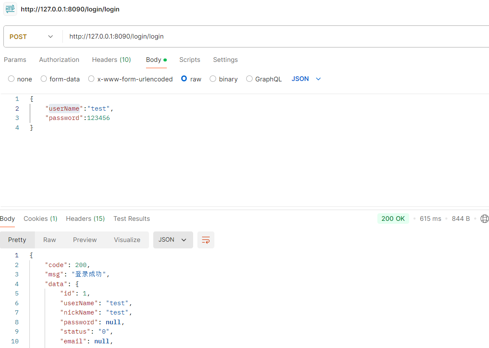
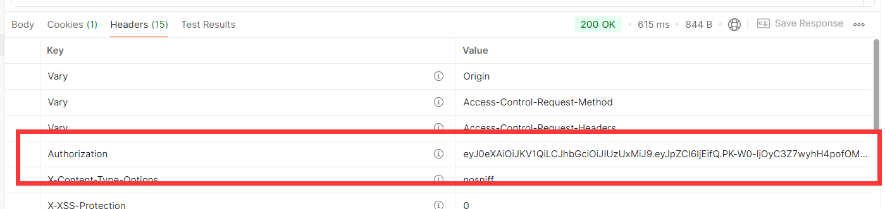
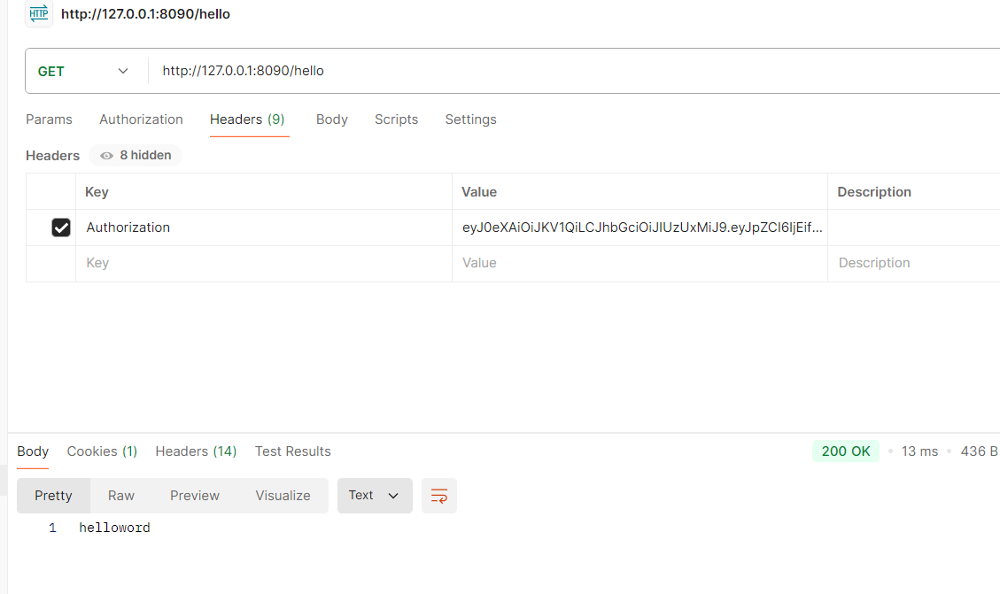
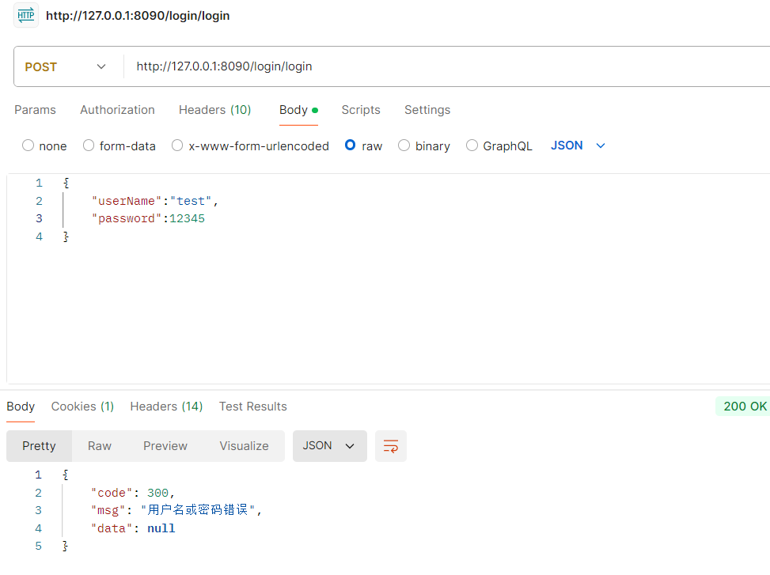
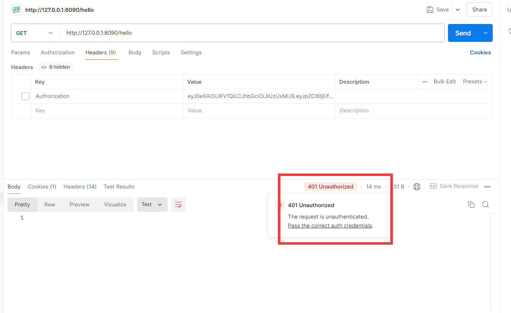
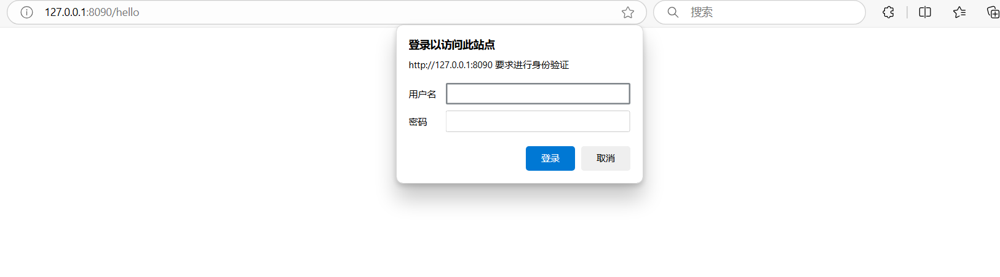

# 基于springboot3.2.0 springsecurity 6的鉴权登录样例

## 运行环境
mysql 8.0 redis springboot3.2.0

## 启动
数据库见db文件，运行前启动mysql导入数据，运行redis，修改配置文件即可

## 实现功能
springsecurity和jwt的整合
登录接口
hello接口
## 示例
### 正常登录
返回用户信息，header种有token

### 访问其他接口

### 账号错误

### 未登录访问其他接口
postman

浏览器

## 其他说明
该题来自某公司笔试题，挺有意思
笔者以前用过springsecurity5，切换到6最明显的是配置写法，WebSecurityConfigurerAdapter废弃了，带来了更好的写法，主要是因为javax升级到jakart带来了全新的api

